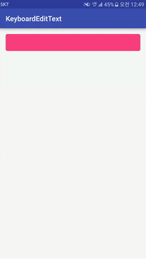

[](http://developer.android.com/index.html)
[](https://android-arsenal.com/api?level=9)
[](http://opensource.org/licenses/MIT)

# KeyboardEditText

KeyboardEditText provides keyboard's shown and hidden event listener for you. You can catch the event and process something whatever you want to.



## Setup Gradle

```groovy
dependencies {
    ...
    compile 'kr.pe.burt.android.lib.keyboardedittext:0.0.1'
}
```

## Usages

Declare KeyboardEditText widget in the layout xml file.

```xml
<?xml version="1.0" encoding="utf-8"?>
<RelativeLayout xmlns:android="http://schemas.android.com/apk/res/android"
    xmlns:tools="http://schemas.android.com/tools"
    android:layout_width="match_parent"
    android:layout_height="match_parent"
    android:paddingBottom="@dimen/activity_vertical_margin"
    android:paddingLeft="@dimen/activity_horizontal_margin"
    android:paddingRight="@dimen/activity_horizontal_margin"
    android:paddingTop="@dimen/activity_vertical_margin"
    tools:context="kr.pe.burt.android.lib.keyboardedittext.app.MainActivity">

    <kr.pe.burt.android.lib.keyboardedittext.KeyboardEditText
        android:id="@+id/editText"
        android:layout_width="match_parent"
        android:layout_height="48dp"
        android:background="@drawable/round_rect"
        android:textColor="@android:color/white"
        android:padding="5dp"
        android:singleLine="true"
        />

    <TextView
        android:id="@+id/textView"
        android:layout_width="wrap_content"
        android:layout_height="wrap_content"
        android:layout_centerInParent="true"
        />
</RelativeLayout>
```

Set the listener for keyboard's show and hide event.

```
public class MainActivity extends AppCompatActivity {

    private KeyboardEditText editText = null;
    private TextView textView = null;

    @Override
    protected void onCreate(Bundle savedInstanceState) {
        super.onCreate(savedInstanceState);
        setContentView(R.layout.activity_main);

        textView = (TextView)findViewById(R.id.textView);
        editText = (KeyboardEditText)findViewById(R.id.editText);
        editText.setOnKeyboardListener(new KeyboardEditText.OnKeyboardListener() {
            @Override
            public void onKeyboardShown(EditText editText) {
                ObjectAnimator animator = ObjectAnimator.ofInt(editText, "bottom",   editText.getBottom(), editText.getBottom() + 300);
                animator.setDuration(1000);
                animator.setInterpolator(new BounceInterpolator());
                animator.start();
            }

            @Override
            public void onKeyboardHidden(EditText editText) {
                textView.setText(editText.getText());

                ObjectAnimator animator = ObjectAnimator.ofInt(textView, "top",   textView.getTop(), textView.getTop() - 200);
                animator.setDuration(1000);
                animator.setInterpolator(new BounceInterpolator());
                animator.start();
            }
        });
    }
}
```

## Callbacks

KeyboardEditText provices listener for keyboard event.

* for listening to keyboard shown
	* onKeyboardShown(EditText editText)
* for listening to keyboard hidden
	* onKeyboardHidden(EditText editText)

## MIT License

The MIT License

Copyright © 2015 Sungcheol Kim, [https://github.com/skyfe79/KeyboardEditText](https://github.com/skyfe79/KeyboardEditText)

Permission is hereby granted, free of charge, to any person obtaining a copy
of this software and associated documentation files (the "Software"), to deal
in the Software without restriction, including without limitation the rights
to use, copy, modify, merge, publish, distribute, sublicense, and/or sell
copies of the Software, and to permit persons to whom the Software is
furnished to do so, subject to the following conditions:

The above copyright notice and this permission notice shall be included in
all copies or substantial portions of the Software.

THE SOFTWARE IS PROVIDED "AS IS", WITHOUT WARRANTY OF ANY KIND, EXPRESS OR
IMPLIED, INCLUDING BUT NOT LIMITED TO THE WARRANTIES OF MERCHANTABILITY,
FITNESS FOR A PARTICULAR PURPOSE AND NONINFRINGEMENT. IN NO EVENT SHALL THE
AUTHORS OR COPYRIGHT HOLDERS BE LIABLE FOR ANY CLAIM, DAMAGES OR OTHER
LIABILITY, WHETHER IN AN ACTION OF CONTRACT, TORT OR OTHERWISE, ARISING FROM,
OUT OF OR IN CONNECTION WITH THE SOFTWARE OR THE USE OR OTHER DEALINGS IN
THE SOFTWARE.